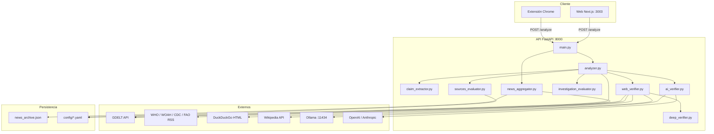

# The NewsBreakers — Arquitectura Técnica

**Documento de referencia para portfolio y Q&A de presentación**  
**Versión:** 1.1.0 · **Fecha:** Junio 2026  
**Equipo:** The NewsBreakers

---

## Tabla de contenidos

1. [Resumen ejecutivo](#1-resumen-ejecutivo)
2. [Objetivo y problema que resuelve](#2-objetivo-y-problema-que-resuelve)
3. [Arquitectura general](#3-arquitectura-general)
4. [Frontend (Next.js)](#4-frontend-nextjs)
5. [Backend (FastAPI)](#5-backend-fastapi)
6. [Base de datos y almacenamiento](#6-base-de-datos-y-almacenamiento)
7. [Librerías Python](#7-librerías-python)
8. [Librerías JavaScript / Node](#8-librerías-javascript--node)
9. [Flujo de verificación de noticias](#9-flujo-de-verificación-de-noticias)
10. [Fuentes de datos](#10-fuentes-de-datos)
11. [IA, Ollama y análisis local](#11-ia-ollama-y-análisis-local)
12. [Extensión Chrome](#12-extensión-chrome)
13. [Scripts de despliegue local](#13-scripts-de-despliegue-local)
14. [Estructura de carpetas](#14-estructura-de-carpetas)
15. [Endpoints API](#15-endpoints-api)
16. [Equipo y colaboración](#16-equipo-y-colaboración)
17. [Tecnologías NO usadas](#17-tecnologías-no-usadas)

---

## 1. Resumen ejecutivo

**The NewsBreakers** es un verificador profesional de desinformación en **salud animal, brotes epizoóticos y zoónosis**. La aplicación permite pegar texto o una URL y obtiene un veredicto explicable (real, falso, no verificada, dudosa) con puntuación 0–100, evidencia enlazada y recomendaciones.

La solución combina:

- **Frontend** en Next.js 15 + React 19 (puerto **3003**).
- **API REST** en FastAPI + uvicorn (puerto **8000**).
- **Motor de análisis** modular en Python: extracción de afirmaciones, búsqueda web en fuentes oficiales, GDELT, modelo de 4 pilares y capa opcional de IA.
- **Extensión Chrome** (Manifest V3) que reutiliza la misma API.
- **Configuración declarativa** en YAML (keywords, fuentes, enfermedades, modelo de investigación).
- **Almacenamiento en archivos JSON** (no hay base de datos relacional en producción).

El proyecto está pensado para demostración ante jurado, stakeholders y portfolio técnico, con documentación, scripts de arranque en Windows y resultados auditables.

---

## 2. Objetivo y problema que resuelve

### Problema

En redes sociales y medios digitales circulan afirmaciones alarmistas sobre brotes, transmisión alimentaria y pandemias animales. Muchas carecen de respaldo en organismos oficiales (OMS/WHO, WOAH, CDC, FAO) y usan lenguaje sensacionalista diseñado para viralizarse.

### Objetivo

Automatizar un **primer filtro de verificación** que:

1. Detecte el idioma y el tema veterinario/epidemiológico.
2. Extraiga afirmaciones concretas (enfermedad, ubicación, fechas, instituciones).
3. Busque evidencia en internet (portales oficiales, GDELT, Wikipedia, fact-checkers).
4. Evalúe la información con un **modelo de 4 pilares** auditable.
5. Opcionalmente refine el veredicto con **IA local (Ollama)** o en la nube (OpenAI/Anthropic).
6. Presente resultados claros en web y extensión de navegador.

### Alcance

- Hasta **10 idiomas** soportados para detección: es, en, fr, pt, de, it, zh, ar, ru, ja.
- Enfoque en **salud animal y brotes**; no es un verificador genérico de política o economía.
- La verificación es **asistida por software**; no sustituye el criterio humano ni la revisión editorial.

---

## 3. Arquitectura general



### Principios de diseño

| Principio | Implementación |
|-----------|----------------|
| Separación de capas | `web/` (UI), `api/` (lógica), `config/` (datos), `extension/` (cliente ligero) |
| Evidencia primero | `web_verifier.py` consulta internet antes de aplicar solo keywords |
| Configuración externa | Keywords, fuentes y modelo de pilares en YAML editables sin recompilar |
| IA opcional | Sin API keys funciona con análisis local por solapamiento de tokens |
| Misma API para todos | Web, extensión y clientes HTTP comparten endpoints |

---

## 4. Frontend (Next.js)

### Stack

| Tecnología | Versión | Uso |
|------------|---------|-----|
| Next.js | ^15.1.0 | Framework App Router |
| React | ^19.0.0 | UI declarativa |
| TypeScript | ^5.7.2 | Tipado estático |
| CSS propio | — | `globals.css` + `dashboard.css` (sin Tailwind ni UI kit externo) |

### Puertos y variables

- **Puerto de desarrollo:** `3003` (`npm run dev` → `next dev -p 3003`)
- **API:** `NEXT_PUBLIC_API_URL` (por defecto `http://localhost:8000`)

### Archivos principales

| Archivo | Responsabilidad |
|---------|-----------------|
| `web/app/layout.tsx` | Layout raíz, metadatos SEO, importación de estilos |
| `web/app/page.tsx` | Dashboard principal: verificador, noticias, historial |
| `web/app/globals.css` | Variables CSS, tipografía, tema oscuro |
| `web/app/dashboard.css` | Componentes del dashboard (cards, grid, chips) |
| `web/components/AnalysisResults.tsx` | Visualización del veredicto, pilares, evidencia, IA |
| `web/components/dashboard/NewsCardItem.tsx` | Tarjeta de noticia del feed |
| `web/components/dashboard/VerificationHistory.tsx` | Historial en `localStorage` del navegador |

### Funcionalidades de la página

1. **Verificador dual:** modo texto o URL (`POST /analyze` o `POST /analyze-url`).
2. **Ejemplos precargados:** noticia confiable, desmentido oficial, texto sospechoso.
3. **Feed de noticias:** pestañas trending / archivo / todas; filtros por fuente (WOAH, OMS, CDC, FAO, GDELT).
4. **Polling automático** cada 10 minutos al endpoint `/news-updates`.
5. **Chips de enfermedades** con nivel de riesgo visual.
6. **Historial local** de verificaciones (no se envía al servidor).
7. **Indicadores de carga** por pasos durante el análisis.

### Diseño

- Interfaz tipo dashboard profesional con paleta oscura.
- Sin dependencias de componentes de terceros (no shadcn, no MUI).
- CSS modular en dos hojas para separar tokens globales y layout del dashboard.

---

## 5. Backend (FastAPI)

### Stack

| Tecnología | Uso |
|------------|-----|
| FastAPI | Framework HTTP, validación Pydantic, OpenAPI automático |
| uvicorn | Servidor ASGI |
| Pydantic v2 | Modelos de request/response |
| Lifespan | Tarea en background para refresco de noticias |

### Punto de entrada: `api/main.py`

- Registra CORS abierto (`*`) para desarrollo local.
- Al arrancar lanza `background_refresh_loop()` del agregador de noticias.
- Expone documentación interactiva en `/docs`.

### Módulos y responsabilidades

| Módulo | Responsabilidad |
|--------|-----------------|
| `analyzer.py` | **Orquestador principal.** Detecta idioma, carga YAML, coordina extracción, verificación web, IA, pilares y veredicto final |
| `claim_extractor.py` | Extrae enfermedades, ubicaciones, fechas, instituciones, afirmaciones de brote y patrones de falsa transmisión |
| `web_verifier.py` | Búsqueda en internet: deep verify, feeds oficiales, Wikipedia, WHO search, GDELT, DuckDuckGo en dominios confiables |
| `deep_verifier.py` | Verificación profunda: URLs en texto, `news_archive.json`, portales oficiales |
| `ai_verifier.py` | Capa IA: OpenAI, Anthropic, Ollama; fallback a análisis local por token overlap |
| `investigation_evaluator.py` | Modelo de **4 pilares** (trazabilidad, coherencia, alarma, rigor) con reglas de descarte R1–R9 |
| `sources_evaluator.py` | Base de 150+ fuentes en tiers gold/silver/bronze; scoring de evidencia |
| `gdelt_fetcher.py` | Cliente GDELT Doc API; construcción de queries desde texto |
| `trusted_search.py` | Wikipedia REST, búsqueda WHO, feeds RSS como evidencia, GDELT con throttle |
| `news_aggregator.py` | Agrega RSS (WHO/CDC/WOAH/FAO) + GDELT; valida relevancia; mantiene `news_archive.json` |
| `disease_catalog.py` | Carga `diseases_catalog.yaml`; patrones regex, pesos de tendencia, queries GDELT |
| `url_fetcher.py` | Extrae texto de URLs con BeautifulSoup (título + artículo) |
| `reference_links.py` | Genera enlaces a buscadores oficiales (WOAH, WAHIS, WHO, CDC, PubMed, etc.) |
| `official_checker.py` | Utilidad auxiliar de comprobación oficial (legacy) |

### Modelo de veredicto

Cuatro estados principales:

| Veredicto | Significado |
|-----------|-------------|
| `verified` | Información con respaldo en fuentes consultadas |
| `false` | Alta probabilidad de fake news / desinformación |
| `unverified` | Sin sustento comprobable |
| `uncertain` | Evidencia parcial; requiere revisión manual |

El score (0–100) combina pilares, evidencia web, penalizaciones por alarma y opcional boost de IA (hasta 98).

---

## 6. Base de datos y almacenamiento

### Lo que SÍ se usa

| Almacén | Ubicación | Propósito |
|---------|-----------|-----------|
| **JSON — archivo de noticias** | `api/news_archive.json` | Histórico de noticias validadas (máx. 500 ítems) |
| **JSON — legacy** | `api/news_updates.json` | Formato anterior; migración automática al archivo |
| **YAML — configuración** | `config/*.yaml` | Keywords, fuentes, enfermedades, modelo de investigación |
| **localStorage (navegador)** | Cliente web | Historial de verificaciones del usuario |
| **Logs** | `logs/api.*.log`, `logs/web.*.log` | Salida de scripts en background |
| **Estado de servicios** | `.run/services.json` | PIDs y URLs al usar `iniciar-background.ps1` |
| **Export scraper** | `data/raw/official_feeds.json` | Generado por `tools/official_scraper.py` (no versionado) |

### Lo que NO se usa en el código actual

| Tecnología | Estado |
|------------|--------|
| **SQLite** | No implementado. La carpeta `data/databases/` está documentada en README como uso futuro, pero no existe en el repositorio ni hay imports de `sqlite3` |
| **PostgreSQL / MySQL / MongoDB** | No utilizados |
| **Redis** | No utilizado |
| **pandas** | **No está en `requirements.txt` ni aparece en ningún archivo del proyecto** |

---

## 7. Librerías Python

Lista completa de `api/requirements.txt`:

| Librería | Versión | Para qué sirve en el proyecto |
|----------|---------|-------------------------------|
| **fastapi** | ≥0.115.6 | Framework de la API REST, rutas, validación, documentación OpenAPI |
| **uvicorn[standard]** | ≥0.34.0 | Servidor ASGI para ejecutar FastAPI en desarrollo y producción local |
| **pydantic** | ≥2.11.0 | Validación de modelos `AnalyzeRequest`, `AnalyzeUrlRequest` y respuestas tipadas |
| **langdetect** | 1.0.9 | Detección automática de idioma del texto analizado (10 idiomas soportados) |
| **pyyaml** | ≥6.0.2 | Lectura de archivos de configuración YAML en `config/` |
| **httpx** | ≥0.28.1 | Cliente HTTP síncrono para GDELT, RSS, WHO, Ollama, OpenAI, Anthropic, scraping |
| **beautifulsoup4** | ≥4.12.3 | Parsing HTML: extracción de texto de URLs, DuckDuckGo, portales oficiales |

### Librerías de la biblioteca estándar relevantes

`asyncio`, `json`, `re`, `pathlib`, `hashlib`, `threading`, `xml.etree.ElementTree`, `urllib.parse`, `datetime`, `functools.lru_cache`, `email.utils`.

### Nota sobre pandas

**pandas NO forma parte del proyecto.** No está en dependencias, no hay `import pandas` en el código y el procesamiento de datos se hace con estructuras nativas de Python (`dict`, `list`) y archivos JSON/YAML.

---

## 8. Librerías JavaScript / Node

### Dependencias de producción (`web/package.json`)

| Paquete | Versión | Uso |
|---------|---------|-----|
| **next** | ^15.1.0 | Framework React con App Router, SSR/CSR, routing |
| **react** | ^19.0.0 | Biblioteca de UI |
| **react-dom** | ^19.0.0 | Renderizado en DOM |

### Dependencias de desarrollo

| Paquete | Versión | Uso |
|---------|---------|-----|
| **typescript** | ^5.7.2 | Tipado estático |
| **@types/node** | ^22.10.0 | Tipos para Node.js |
| **@types/react** | ^19.0.0 | Tipos para React |
| **@types/react-dom** | ^19.0.0 | Tipos para React DOM |

### Scripts npm

| Script | Comando | Descripción |
|--------|---------|-------------|
| `dev` | `next dev -p 3003` | Servidor de desarrollo |
| `build` | `next build` | Build de producción |
| `start` | `next start` | Servidor de producción |
| `clean` | Elimina `.next` | Limpieza de caché |
| `rebuild` | clean + build | Reconstrucción completa |

**No se usan:** Axios (fetch nativo), Redux/Zustand (useState/useCallback), Tailwind, shadcn, Chart.js, etc.

---

## 9. Flujo de verificación de noticias

### Paso a paso (endpoint `POST /analyze`)

```
1. RECEPCIÓN
   └─ FastAPI valida texto (mín. 10 caracteres) y flags use_gdelt / use_official

2. DETECCIÓN DE IDIOMA
   └─ langdetect → es, en, fr, pt, de, it, zh, ar, ru, ja (fallback: en)

3. CARGA DE CONFIGURACIÓN
   └─ keywords.yaml → topic, alarm, trust por idioma
   └─ trusted_sources.yaml → dominios oficiales y fact-checkers

4. EXTRACCIÓN DE AFIRMACIONES (claim_extractor.py)
   └─ Enfermedades (catálogo + regex H5N1, etc.)
   └─ Ubicaciones, fechas, recuentos de casos
   └─ Instituciones (WHO, WOAH, CDC…)
   └─ Flags: brote afirmado, falsa transmisión alimentaria, explicación de mecanismo

5. VERIFICACIÓN EN INTERNET (web_verifier.py)
   ├─ deep_verifier: URLs del texto + news_archive.json + WHO ampliado
   ├─ Feeds RSS oficiales (WHO, CDC, WOAH, FAO)
   ├─ Wikipedia REST API
   ├─ Portal de búsqueda WHO
   ├─ GDELT Doc API (con throttle 5.5s)
   └─ DuckDuckGo HTML en dominios oficiales/científicos

6. ANÁLISIS IA (ai_verifier.py) — opcional
   ├─ Si hay OPENAI_API_KEY → GPT
   ├─ Si hay ANTHROPIC_API_KEY → Claude
   ├─ Si hay OLLAMA_MODEL → Ollama local
   └─ Si no hay LLM → análisis local por solapamiento de tokens

7. SCORING DE FUENTES (sources_evaluator.py)
   └─ Tiers gold/silver/bronze, confianza 0–100, peso de evidencia

8. MODELO DE 4 PILARES (investigation_evaluator.py)
   ├─ P1: Trazabilidad de fuente
   ├─ P2: Coherencia epidemiológica
   ├─ P3: Señales de alarma / desinformación
   ├─ P4: Rigor y contexto científico
   └─ Reglas de descarte R1–R9

9. VEREDICTO FINAL (analyzer._compute_verdict)
   └─ Combina evidencia + pilares + alarma → verified | false | unverified | uncertain

10. BOOST IA (ai_reliability_boost)
    └─ Puede elevar score hasta 98 si IA + fuentes oficiales coinciden

11. RESPUESTA JSON
    └─ verdict, verdict_es, score, evidence, claims, investigation_model, recommendations
```

### Análisis por URL (`POST /analyze-url`)

1. `url_fetcher.py` descarga y extrae texto (BeautifulSoup).
2. Se llama a `analyze_text()` con el texto extraído.
3. Se añaden `source_url` y metadatos de extracción.

---

## 10. Fuentes de datos

### APIs y servicios externos

| Fuente | Tipo | Uso en el proyecto |
|--------|------|-------------------|
| **GDELT** | API REST (`api.gdeltproject.org`) | Cobertura mediática global; corroboración de titulares |
| **WHO** | RSS + búsqueda web | Noticias oficiales y portal search |
| **WOAH** | RSS | Alertas zoosanitarias; WAHIS referenciado |
| **CDC** | RSS | Noticias de enfermedades infecciosas |
| **FAO** | RSS | Seguridad alimentaria y salud animal |
| **Wikipedia** | REST API v1 | Referencia científica base por enfermedad |
| **DuckDuckGo** | HTML scraping | Búsqueda acotada a dominios oficiales |
| **ProMED / HealthMap / PubMed** | Enlaces de verificación manual | `reference_links.py` |

### Base de fuentes interna

- `config/sources_database.yaml` — **150+ fuentes** con tier, confianza, especialización.
- `config/trusted_sources.yaml` — Listas rápidas de dominios por categoría.
- `config/diseases_catalog.yaml` — Catálogo de enfermedades con patrones multilingües y términos GDELT.

### Herramienta offline

`tools/official_scraper.py` — Script independiente que descarga RSS de WHO/CDC/WOAH y exporta a `data/raw/official_feeds.json` filtrando por keywords de salud animal.

---

## 11. IA, Ollama y análisis local

### Prioridad de proveedores (`ai_verifier._resolve_provider`)

1. **OpenAI** — si `OPENAI_API_KEY` está definida (modelo por defecto: `gpt-4o-mini`)
2. **Anthropic** — si `ANTHROPIC_API_KEY` (modelo: `claude-3-5-haiku-20241022`)
3. **Ollama** — si `OLLAMA_MODEL` (URL por defecto: `http://localhost:11434`)
4. **Análisis local** — si no hay ningún proveedor configurado

### Análisis local (sin LLM)

Cuando no hay API keys, `ai_verifier.py` ejecuta `_verify_local()`:

- Calcula solapamiento de tokens entre la afirmación y fragmentos oficiales.
- Detecta coincidencia de enfermedades citadas.
- Devuelve `supports`, `contradicts` o `insufficient` con confianza conservadora.
- **La aplicación funciona completamente sin IA en la nube.**

### Configuración

Variables en `api/.env` (opcional, ver `api/.env.example`):

```env
OPENAI_API_KEY=...
OPENAI_MODEL=gpt-4o-mini
ANTHROPIC_API_KEY=...
ANTHROPIC_MODEL=claude-3-5-haiku-20241022
OLLAMA_BASE_URL=http://localhost:11434
OLLAMA_MODEL=llama3.2
```

### Endpoint de estado

`GET /health` reporta si IA está habilitada, proveedor activo y modelo en uso.

---

## 12. Extensión Chrome

### Ubicación

`extension/` — Manifest V3.

### Archivos

| Archivo | Contenido |
|---------|-----------|
| `manifest.json` | Permisos: `activeTab`, `scripting`; host `localhost:8000` |
| `popup.html` | UI mínima del popup |
| `popup.js` | Extrae texto de la pestaña activa y llama `POST /analyze` |

### Flujo

1. Usuario hace clic en el icono de la extensión.
2. Se ejecuta script en la pestaña: `document.querySelector("article")` o `body.innerText`.
3. Se envía hasta 12 000 caracteres a `http://localhost:8000/analyze`.
4. Se muestra veredicto, score, idioma y recomendaciones.

### Requisito

La API debe estar corriendo en `localhost:8000`. La extensión no incluye lógica de verificación propia.

---

## 13. Scripts de despliegue local

Todos en `scripts/`, configuración central en `tnb-config.ps1`:

| Variable | Valor |
|----------|-------|
| `$TnbApiPort` | 8000 |
| `$TnbWebPort` | 3003 |

### Scripts disponibles

| Script | Función |
|--------|---------|
| `iniciar.ps1` | Crea venv si falta, instala deps, abre **dos ventanas** PowerShell (API + Web) |
| `iniciar-background.ps1` | Arranca API y Web en **segundo plano**, escribe logs en `logs/`, guarda PIDs en `.run/services.json` |
| `detener.ps1` | Detiene procesos en puertos 8000 y 3003 |
| `instalar-inicio.ps1` | Registra arranque automático al iniciar Windows |
| `desinstalar-inicio.ps1` | Elimina arranque automático |
| `tnb-config.ps1` | Rutas y puertos compartidos |

### Arranque manual

```powershell
# API
cd api
python -m venv .venv
.\.venv\Scripts\activate
pip install -r requirements.txt
uvicorn main:app --reload --port 8000

# Web
cd web
npm install
npm run dev   # → http://localhost:3003
```

---

## 14. Estructura de carpetas

```
the-newsbreakers/
├── api/                    # Backend FastAPI
│   ├── main.py             # Endpoints y lifespan
│   ├── analyzer.py         # Motor principal
│   ├── claim_extractor.py
│   ├── web_verifier.py
│   ├── deep_verifier.py
│   ├── ai_verifier.py
│   ├── investigation_evaluator.py
│   ├── sources_evaluator.py
│   ├── gdelt_fetcher.py
│   ├── trusted_search.py
│   ├── news_aggregator.py
│   ├── disease_catalog.py
│   ├── url_fetcher.py
│   ├── reference_links.py
│   ├── news_archive.json   # Archivo de noticias
│   ├── requirements.txt
│   └── .env.example
├── web/                    # Frontend Next.js
│   ├── app/
│   │   ├── page.tsx
│   │   ├── layout.tsx
│   │   ├── globals.css
│   │   └── dashboard.css
│   └── components/
│       ├── AnalysisResults.tsx
│       └── dashboard/
├── extension/              # Extensión Chrome MV3
├── config/                 # YAML de configuración
│   ├── keywords.yaml
│   ├── trusted_sources.yaml
│   ├── sources_database.yaml
│   ├── diseases_catalog.yaml
│   ├── investigation_model.yaml
│   └── indicators.yaml
├── tools/                  # Utilidades (scraper, generador PDF)
├── scripts/                # PowerShell de arranque
├── docs/                   # Documentación
├── assets/
│   ├── pdfs/               # Documentos PDF
│   ├── images/
│   └── excels/
├── logs/                   # Logs de servicios background
└── README.md
```

---

## 15. Endpoints API

| Método | Ruta | Descripción | Parámetros / Body |
|--------|------|-------------|-------------------|
| GET | `/` | Info básica de la API | — |
| GET | `/health` | Estado, versión, IA activa | — |
| GET | `/sources` | Resumen de base de fuentes (tiers) | — |
| GET | `/source/{domain}` | Detalle de una fuente por dominio | `domain` (ej. `who.int`) |
| POST | `/analyze` | Analiza texto | `{ text, use_gdelt?, use_official? }` |
| POST | `/analyze-url` | Analiza URL | `{ url, use_gdelt?, use_official? }` |
| GET | `/gdelt/search` | Búsqueda directa GDELT | `q`, `limit` |
| GET | `/gdelt/query-from-text` | Genera query GDELT desde texto | `text` |
| GET | `/news-updates` | Feed de noticias validadas | `limit`, `offset`, `days`, `source`, `archive`, `trending`, `validated_only`, `refresh` |
| POST | `/news-updates/refresh` | Fuerza refresco del archivo | — |

Documentación interactiva: **http://localhost:8000/docs**

---

## 16. Equipo y colaboración

### Repositorio

- GitHub: `https://github.com/JAVGP444/The-NewsBreakers`
- Licencia: **MIT** (proyecto académico / datathon)

### Cómo colaborar

1. Clonar el repositorio y seguir el inicio rápido del README.
2. Backend: crear rama, editar módulos en `api/` o YAML en `config/`.
3. Frontend: cambios en `web/app/` y `web/components/`.
4. Probar con `scripts/iniciar.ps1` o arranque manual.
5. Documentar cambios en `docs/` si afectan metodología o arquitectura.

### Convenciones

- Configuración sensible solo en `api/.env` (nunca commitear).
- Python 3.13+ compatible (wheels sin compilación Rust).
- API y web en puertos fijos 8000 / 3003 para la extensión Chrome.

---

## 17. Tecnologías NO usadas

Para evitar confusiones en Q&A de portfolio:

| Tecnología | ¿Se usa? | Notas |
|------------|----------|-------|
| **pandas** | **NO** | No está en requirements ni en el código |
| **numpy** | NO | No requerido |
| **SQLite / PostgreSQL** | NO | Solo JSON + YAML; carpeta `data/databases` es planificada, no implementada |
| **Docker** | NO | Despliegue local con venv + npm |
| **Kubernetes** | NO | — |
| **Redis / Celery** | NO | Refresh de noticias con `asyncio` + threading |
| **Tailwind CSS** | NO | CSS propio |
| **GraphQL** | NO | Solo REST |
| **WebSockets** | NO | Polling HTTP en el frontend |
| **TensorFlow / PyTorch** | NO | IA vía APIs externas o Ollama |
| **Elasticsearch** | NO | Búsqueda vía GDELT y scraping |

---

*Documento generado para The NewsBreakers — Junio 2026*
